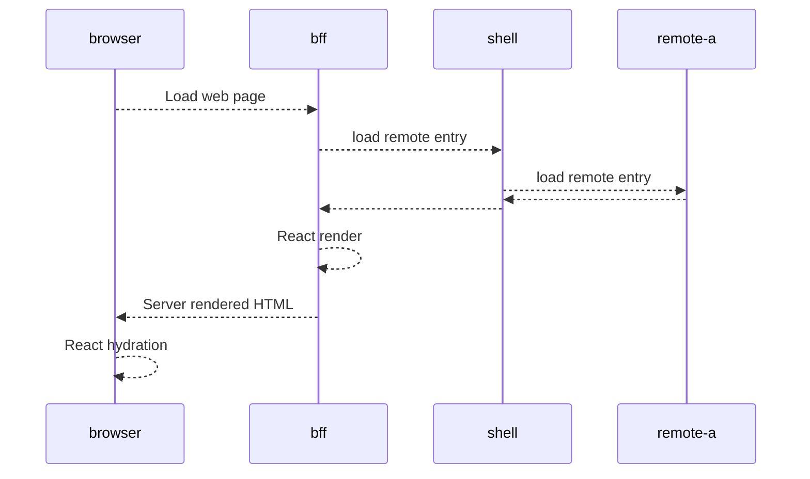

# nailsmith

A minimal example of how we can do SSR with module federation

## Architecture



## Local dev

```sh
# Install deps
npm i
# Run the shell first on port 3001
npm run dev --workspace packages/shell
# Run the node server for the backend on port 3000
# Load this url: http://localhost:3000/
npm run dev --workspace packages/bff
```
